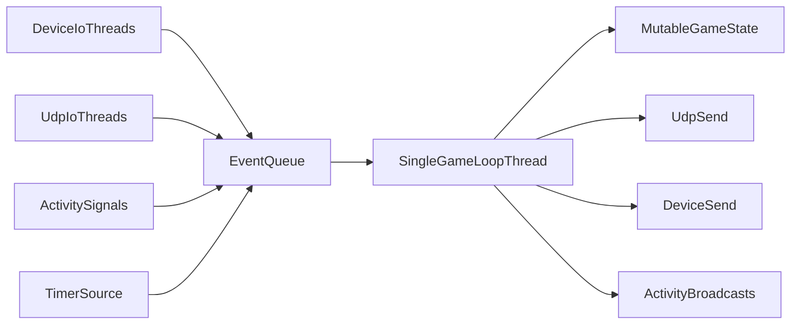

# Android Single-Thread Event Queue Conversion Plan

## Goal

Convert Android gameplay state handling to a single-writer architecture so all mutable game state is updated in one deterministic thread, preventing races like `YOU_KILLED` with stale/non-zero health.

## Current Hotspots

- Shared mutable state (`thisPlayer`, `allPlayersSnapshot`, `isGameRunning`, `teamPlay`) is mutated from multiple callbacks in `[/home/rrr/ws/lasertag-android/lasertag-app/src/main/java/net/lasertag/GameService.java](/home/rrr/ws/lasertag-android/lasertag-app/src/main/java/net/lasertag/GameService.java)`.
- `EventMessageToServer` currently reads live `player.health` at construction time in `[/home/rrr/ws/lasertag-android/lasertag-app/src/main/java/net/lasertag/model/WirelessMessage.kt](/home/rrr/ws/lasertag-android/lasertag-app/src/main/java/net/lasertag/model/WirelessMessage.kt)`, enabling type/health mismatch under concurrency.

## Target Architecture

## Implementation Steps

1. Introduce a unified internal event model in `GameService`.
  - Add sealed-style event classes/interfaces for `DeviceEvent`, `ServerEvent`, `TimerTick`, and `ActivityLifecycleEvent`.
  - Include immutable payload snapshots (e.g., explicit health/type/extra values) so downstream logic never rereads mutable shared objects.
2. Add a single-thread processing loop in `GameService`.
  - Create one dedicated `HandlerThread` or `newSingleThreadExecutor` queue consumer.
  - Convert existing callbacks (`handleEventFromDevice`, `handleEventFromServer`, timer callback, activity resumed/paused receiver) to enqueue-only entrypoints.
3. Move all state mutation into one reducer-like method.
  - Centralize updates for `thisPlayer`, `allPlayersSnapshot`, `isGameRunning`, `teamPlay`, and timers.
  - Ensure `evaluateCurrentState()` and state-dependent side effects are called only from the game-loop thread.
4. Make outbound gameplay packets deterministic.
  - Build outbound payloads from local immutable values computed during event handling (not live reads from shared objects after branching).
  - Update event send construction path in `GameService` and, if needed, extend constructors in `WirelessMessage.kt` to accept explicit values.
5. Keep I/O concurrent but side-effect constrained.
  - Keep UDP receive/send and serial/Bluetooth reads on background I/O threads.
  - Restrict them to parsing + queue submit; no direct mutation of gameplay state.
6. Preserve UI behavior with thread-safe broadcast boundaries.
  - Continue broadcasting service updates to `MainActivity`.
  - Ensure broadcasts are emitted from consistent post-reducer snapshots to avoid transient contradictory UI states.
7. Add observability and regression checks.
  - Add structured logs around enqueue/dequeue with event type, sequence id, and computed health/type before send.
  - Add targeted tests (or instrumentation hooks) for hit/kill ordering and rapid interleaving of snapshot/device events.

## Files to Change (Expected)

- `[/home/rrr/ws/lasertag-android/lasertag-app/src/main/java/net/lasertag/GameService.java](/home/rrr/ws/lasertag-android/lasertag-app/src/main/java/net/lasertag/GameService.java)`
- `[/home/rrr/ws/lasertag-android/lasertag-app/src/main/java/net/lasertag/model/WirelessMessage.kt](/home/rrr/ws/lasertag-android/lasertag-app/src/main/java/net/lasertag/model/WirelessMessage.kt)`
- Possibly minimal callback wrappers in:
  - `[/home/rrr/ws/lasertag-android/lasertag-app/src/main/java/net/lasertag/communication/UdpClient.java](/home/rrr/ws/lasertag-android/lasertag-app/src/main/java/net/lasertag/communication/UdpClient.java)`
  - `[/home/rrr/ws/lasertag-android/lasertag-app/src/main/java/net/lasertag/communication/SerialClient.java](/home/rrr/ws/lasertag-android/lasertag-app/src/main/java/net/lasertag/communication/SerialClient.java)`

## Rollout Strategy

- Phase 1: Introduce queue + reducer while preserving existing message semantics.
- Phase 2: Switch callbacks to enqueue-only and remove direct cross-thread mutations.
- Phase 3: Enable diagnostics, validate with stress scenarios (rapid hits + incoming snapshots), then clean obsolete synchronization/volatile fields.

## Acceptance Criteria

- No direct game-state mutation outside game-loop thread.
- No packet where `type=YOU_KILLED` is sent with `health>0`.
- Stable state transitions (`OFFLINE/IDLE/GAME/DEAD`) under rapid event bursts.
- UI and sound behavior remain functionally equivalent during normal play.
