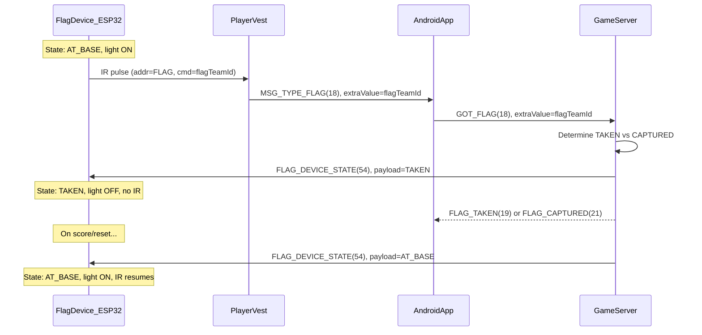

# Capture The Flag Game Mode Implementation

## Flag device data flow



## 1. Add GameType Enum -- DONE

Create [`src/main/java/net/lasertag/lasertagserver/core/GameType.java`](src/main/java/net/lasertag/lasertagserver/core/GameType.java):

```java
public enum GameType {
    DM(false),
    TEAM_DM(true),
    CTF(true);
    
    private final boolean teamBased;
    
    GameType(boolean teamBased) { this.teamBased = teamBased; }
    public boolean isTeamBased() { return teamBased; }
}
```

## 2. Add Team Score Tracking -- DONE

In [`ActorRegistry.java`](src/main/java/net/lasertag/lasertagserver/core/ActorRegistry.java):

- Add `Map<Integer, Integer> teamScores` field (stored, not computed)
- Add `incrementTeamScore(int teamId)` method
- Add `resetTeamScores()` for game start
- Keep existing `getTeamScores()` but return the stored map

## 3. Update GameSettingsPreset -- DONE

In [`GameSettingsPreset.java`](src/main/java/net/lasertag/lasertagserver/core/GameSettingsPreset.java):

- Replace `boolean teamPlay` with `GameType gameType`
- Add convenience method: `boolean isTeamPlay() { return gameType.isTeamBased(); }`
- Update `getAllSettings()` to include `gameType`

## 4. Add CTF Message Types -- DONE

In [`MessageType.java`](src/main/java/net/lasertag/lasertagserver/model/MessageType.java):

- `FLAG_TAKEN` (19) -- player picked up enemy flag
- `FLAG_LOST` (20) -- flag carrier killed, flag auto-returns
- `FLAG_CAPTURED` (21) -- flag delivered to home base, team scores
- `GOT_FLAG` (18) -- player interacted with a flag (already exists)

## 5. Update Game Logic -- DONE (partial, needs flag device integration)

In [`Game.java`](src/main/java/net/lasertag/lasertagserver/core/Game.java):

**Already implemented:**

- `FLAG_TAKEN`: Set `player.setFlagCarrier(true)`, broadcast to all
- `FLAG_CAPTURED`: Increment team score, set `player.setFlagCarrier(false)`, check win condition
- `FLAG_LOST` on carrier killed: clear flagCarrier, broadcast

**Needs update for flag devices (see section 9):**

- Replace direct `FLAG_TAKEN`/`FLAG_CAPTURED` handling with server-authoritative `GOT_FLAG` routing
- Add flag device state commands on taken/captured/lost/reset

## 6. Update Protocol -- DONE

In [`Messaging.java`](src/main/java/net/lasertag/lasertagserver/model/Messaging.java):

- Change byte 3 from `teamPlay` boolean to `gameType.ordinal()` (0=DM, 1=TDM, 2=CTF)

In [`Game.java`](src/main/java/net/lasertag/lasertagserver/core/Game.java) line 99:

- Send `gameType.ordinal()` instead of `isTeamPlay() ? 1 : 0`

## 7. Update Web UI -- DONE

In [`app.js`](src/main/resources/static/app.js):

- Replace `teamPlay: false` with `gameType: 'DEATHMATCH'`
- Update `startGame()` to send `gameType` string
- Add computed property `isTeamBased` to check if current game type is team-based
- Add computed property `availableTeams` returning only Red (0) and Blue (1) for team modes

In [`index.html`](src/main/resources/static/index.html):

- Replace TeamPlay checkbox with Game Type dropdown: Deathmatch / Team Deathmatch / CTF
- Show team scores section for all team-based modes
- Limit player team dropdown to Red/Blue only when game type is team-based

## 8. Update API -- DONE

In [`GameController.java`](src/main/java/net/lasertag/lasertagserver/web/GameController.java):

- Change `StartGameRequest.teamPlay` to `gameType` (String or enum)
- Parse and validate game type

## 9. Flag Device Firmware (device/dispenser extension)

Two physical ESP32 beacons (red flag, blue flag) sharing the dispenser codebase.
One firmware, role selected at compile time via `#ifdef`.

### [definitions.h](device/dispenser/src/definitions.h)

- Add role defines alongside existing `HEALTH`/`AMMO`:

```cpp
//#define HEALTH
//#define AMMO
#define FLAG_RED
// or FLAG_BLUE
```

- Add conditional blocks for flag roles:

```cpp
#ifdef FLAG_RED
  #define IR_ADDRESS (IR_ADDRESS_FLAG)
  #define IR_COMMAND 0  // team red
  #define MSG_TYPE_PING (MSG_TYPE_FLAG_PING)
#endif
#ifdef FLAG_BLUE
  #define IR_ADDRESS (IR_ADDRESS_FLAG)
  #define IR_COMMAND 1  // team blue
  #define MSG_TYPE_PING (MSG_TYPE_FLAG_PING)
#endif
```

- Add new message constants:

```cpp
#define MSG_TYPE_FLAG_PING 47
#define MSG_TYPE_IN_FLAG_STATE 54
#define FLAG_STATE_AT_BASE 0
#define FLAG_STATE_TAKEN 1
```

### [main.cpp](device/dispenser/src/main.cpp)

- Change IR send to use `IR_COMMAND` instead of `DEVICE_ID` as the command byte for flags:

```cpp
#if defined(FLAG_RED) || defined(FLAG_BLUE)
  IrSender.sendSony(IR_ADDRESS, IR_COMMAND, 2, SIRCS_12_PROTOCOL);
#else
  IrSender.sendSony(IR_ADDRESS, DEVICE_ID, 2, SIRCS_12_PROTOCOL);
#endif
```

- Add flag state variable (`volatile uint8_t flagState = FLAG_STATE_AT_BASE`)
- Gate the main loop IR emission + light on `flagState == FLAG_STATE_AT_BASE` instead of `timeSinceLastDispense > dispenseTimeoutSec`
- Handle new incoming message `MSG_TYPE_IN_FLAG_STATE` in `taskUdpReceiver`:

```cpp
} else if (type == MSG_TYPE_IN_FLAG_STATE) {
    flagState = incomingPacket[1];
}
```

- For flags, ignore `DISPENSER_USED` / `DISPENSER_SET_TIMEOUT` (guard with `#if !defined(FLAG_RED) && !defined(FLAG_BLUE)`)

## 10. Server: Flag Actor Registration and GOT_FLAG Routing

### [Actor.java](server/src/main/java/net/lasertag/lasertagserver/model/Actor.java)

- Add `FLAG` to `Actor.Type` enum: `PLAYER, HEALTH, AMMO, FLAG`

### [MessageType.java](server/src/main/java/net/lasertag/lasertagserver/model/MessageType.java)

- Add `FLAG_PING` (47) as CLIENT_TO_SERVER
- Add `FLAG_DEVICE_STATE` (54) as SERVER_TO_CLIENT

### [Messaging.java](server/src/main/java/net/lasertag/lasertagserver/model/Messaging.java)

- Add `FLAG_PING.id()` to `PING_GROUP`

### [ActorRegistry.java](server/src/main/java/net/lasertag/lasertagserver/core/ActorRegistry.java)

- Register 2 flag actors in constructor (id 0 = red, id 1 = blue):

```java
for (int i = 0; i < 2; i++) {
    actors.add(new Dispenser(i, Actor.Type.FLAG));
}
```

- Add flag lookup in `getActorByMessage()` for `FLAG_PING` type

### [UdpServer.java](server/src/main/java/net/lasertag/lasertagserver/core/UdpServer.java)

- On flag device connect (`actor.getType() == Actor.Type.FLAG`), send current flag state
- Add method `sendFlagState(Actor flagActor, byte state)` that sends `FLAG_DEVICE_STATE` with payload

### [Game.java](server/src/main/java/net/lasertag/lasertagserver/core/Game.java)

Server-authoritative flag logic -- handle `GOT_FLAG(18)` in `onMessageFromPlayer()`:

- `extraValue` = flag team id (0=red, 1=blue)
- If flag team != player team and flag is at base: **FLAG_TAKEN**
  - set `player.flagCarrier=true`
  - send `FLAG_DEVICE_STATE(TAKEN)` to that flag device
  - broadcast `FLAG_TAKEN` to players
- If flag team == player team and player is carrying flag and own flag is at base: **FLAG_CAPTURED**
  - increment team score, clear flagCarrier
  - send `FLAG_DEVICE_STATE(AT_BASE)` to the *enemy* flag
  - broadcast `FLAG_CAPTURED`
- Otherwise ignore
- On `FLAG_LOST` (carrier killed): send `FLAG_DEVICE_STATE(AT_BASE)` to the taken flag device
- On game start/end: reset all flag devices to `AT_BASE`

## 11. Android: Handle GOT_FLAG

### [GameService.java](android/lasertag-app/src/main/java/net/lasertag/GameService.java)

- Add `case Messaging.GOT_FLAG` in `handleEventFromDevice()`:
  - Always propagate to server (server is authoritative about flag logic)
  - Suppress if player is dead or game not running

## Key design decisions

- **One firmware codebase** with compile-time role selection (`#ifdef FLAG_RED` / `FLAG_BLUE` / `HEALTH` / `AMMO`)
- **Server-authoritative flag state**: the flag device doesn't decide taken/captured; the server tells it what state to be in
- **IR command byte** = flag team id (not device id), so the receiving player's phone can pass the team info to the server
- **Reuse `Dispenser` model class** on the server for flag actors (already has the fields needed; just a new `Actor.Type`)
